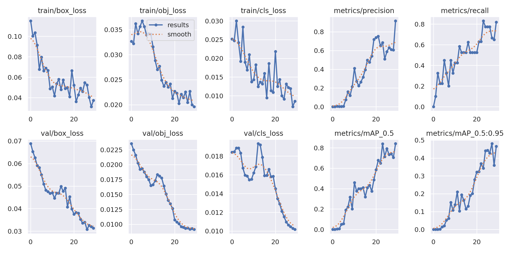
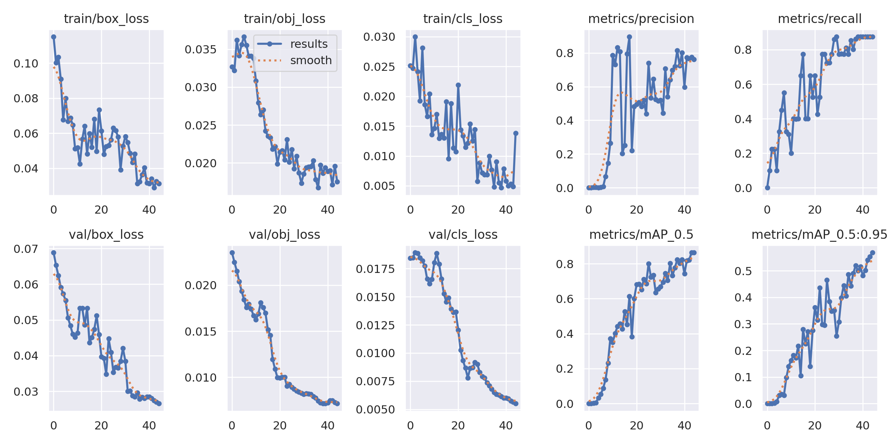
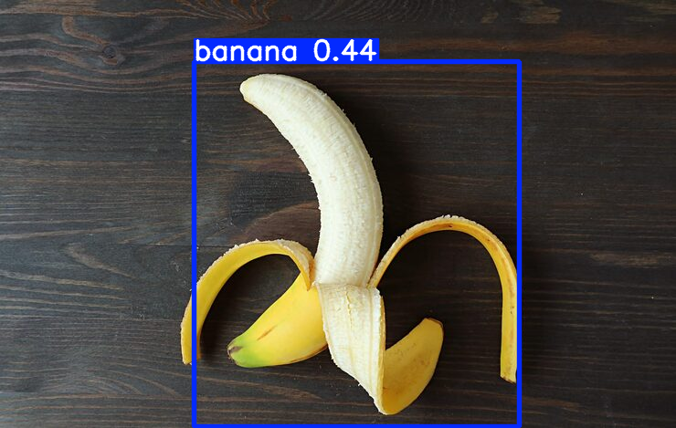
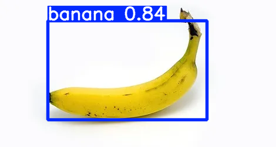
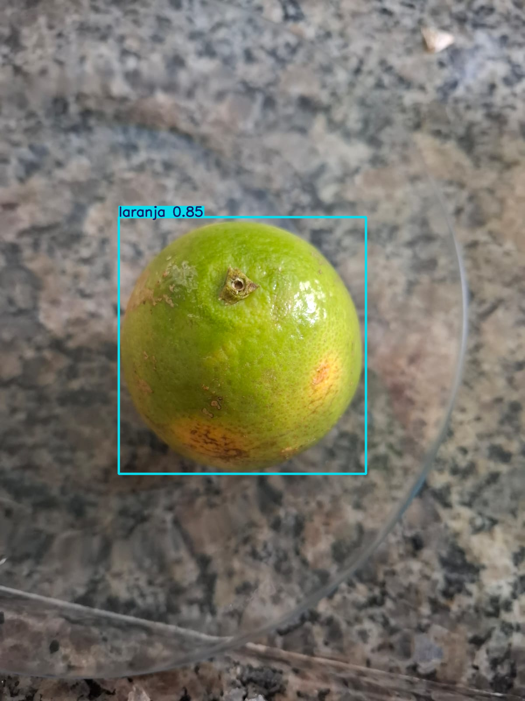

    <h1>FIAP - Faculdade de Informática e Administração Paulista</h1>
    

 

## O despertar da rede neural — Introdução à visão computacional

## 👨‍🎓 Integrantes:

- <a href="https://www.linkedin.com/in/gabriel-oliveira-b6353a16b/">Gabriel Oliveira dos Santos</a>
- <a href="https://www.linkedin.com/in/roberson-pedrosa-304ab523a/">Roberson Pedrosa de Oliveira Junior</a>
- <a href="https://www.linkedin.com/in/arthur-bruttel-7171b8381">Arthur Bruttel Nascimento</a>
- <a href="https://www.linkedin.com/in/jonviotti/">Jonatan Viotti Rodrigues da Silva</a>
- <a href="https://www.linkedin.com/in/eusamuelrocha/">Samuel Nicolas Oliveira Rocha</a>

## 👩‍🏫 Professores:

### Tutora
- <a href="https://www.linkedin.com/in/sabrina-otoni-22525519b/">Sabrina Otoni</a>
### Coordenador
- <a href="https://www.linkedin.com/company/inova-fusca">André Godoi Chiovato</a>

## Links:

- <a href="https://www.youtube.com/watch?v=iL0PgznzNYw">Vídeo demonstrativo — FarmTech: visão computacional</a>
- <a href="https://drive.google.com/drive/folders/1QkMjpWbr78nk51uMblVASSsta4NVClyc?usp=drive_link">Download do dataset</a>
- <a href="https://www.makesense.ai">Makesense.ai</a>
- 
- <a href="Vcomputacional_entrega2_fase6.ipynb">Notebook — Entrega 2 (YOLO tradicional + CNN do zero)</a>

## 🚀 Como Executar o Projeto

### Entrega 1 — YOLOv5 Customizado
1. Faça o download do dataset pelo link disponibilizado
2. Realize o upload da pasta no seu Google Drive
3. Acesse o notebook da Entrega 1 no Google Colab
4. Execute todas as células em ordem
5. Conceda as permissões de acesso ao Google Drive quando solicitado

### Entrega 2 — YOLO Tradicional + CNN do Zero
1. Use o mesmo dataset da Entrega 1
2. Abra o arquivo `Vcomputacional_entrega2_fase6.ipynb` no Google Colab
3. Execute todas as células em ordem
4. Os labels da pasta `train/labels` e `test/labels` são necessários para a CNN

---
## 📜 Descrição - Entrega 1

Nessa entrega foi nos dado o papel de desenvolvedores em uma empresa (FarmTech). O objetivo é a criação de um sistema de visão computacional utilizando o YOLO (um algoritmo de detecção de objetos em tempo real amplamente utilizado em aplicações de visão computacional) para o reconhecimento de dois objetos.

O cenário de imagens ficou à critério da equipe, contudo, foram determinadas 40 imagens por objeto (totalizando 80), sendo elas:

- 32 para treino
- 4 para validação
- 4 para teste

Ademais, foi solicitado a utilização da ferramenta makesense.ai para a rotulação (labels) de cada imagem através do processo de bounding box.

---

### 1. Introdução

Dando início ao projeto, o primeiro passo foi a montagem do dataset. Realizamos a escolha de banana e laranja por serem facilmente encontradas, juntamos 40 imagens de cada e dividimos de acordo com o solicitado (treino, validação e teste). Logo após, acessamos o Makesense.ai, rotulamos e, então, fizemos o upload do folder (pasta) no Google Drive. 

A seguir, acessamos o Google Colab, realizamos a importação do Drive e começamos a estruturação do código.

### 2. Estruturação

A montagem do código girou em torno de decisões e modificações. A priori, tínhamos a ideia de realizar um treinamento com 30 e 60 epochs (vezes em que o modelo roda do começo ao fim), porém, o número mais alto demonstrou uma maior possibilidade de overfitting, portanto, foi realizada a alteração para 30 e 45 epochs, gerando resultados estáveis.

Outra mudança foi nas imagens de treino do dataset. Após realizar o treinamento do modelo, a classe banana gerava dados medianos, apresentando uma dificuldade no reconhecimento das imagens. Sendo assim, foi necessário a alteração de algumas imagens. Essa alteração proporcionou uma evolução nos resultados da classe, fazendo com que tanto a banana quanto a laranja apresentassem um bom desempenho, mesmo com o número limitado de imagens proposto.

### 3. Treinamento

Como dito anteriormente, o treinamento foi realizado através do algoritmo YOLO. E seguiu as seguintes características:

- imagens fixadas em 640 pixels
- batch 16 (número de imagens utilizadas por vez)
- 30 e 45 epochs

Ao final do treinamento, foram obtidas métricas como precision (precisão), recall e mAP (mean average precision).

### 🔹 Treinamento com 30 epochs (épocas)

🍌 **Banana:**

- Precision: 0.668
- Recall: 0.504
- mAP50: 0.782

🍊 **Laranja:**

- Precision: 0.543
- Recall: 0.8
- mAP50: 0.703

### 🔹 Treinamento com 45 epochs (épocas)

🍌 **Banana:**

- Precision: 0.915
- Recall: 0.75
- mAP50: 0.888

🍊 **Laranja:**

- Precision: 0.607
- Recall: 1
- mAP50: 0.84

## 📈 Representação gráfica

### Experimento 1 — 30 epochs

### Experimento 2 — 45 epochs

Como demonstrado em ambas as imagens, a perda diminui ao longo do tempo, enquanto a precisão e o recall aumentam. Isso indica uma evolução consistente do modelo de visão computacional.

Vale ressaltar também que optamos por construir um dataset variado com a utilização de diferentes estados das frutas (cortadas, descascadas, inteiras), essa variação tornou a detecção mais desafiadora. Como consequência, houve uma leve redução na confiança do modelo, porém uma entrega de resultados mais sólidos.

Abaixo estão alguns exemplos do reconhecimento dos objetos, vale ressaltar que as imagens possuem tamanhos naturais distintos, portanto, para a criação desse README foi utilizado um tamanho fixo para 1000 pixels.

### Imagem de teste 1

### Imagem de teste 2

### Imagem de teste 3

### Imagem de teste 4

---
## 🔬 Descrição - Entrega 2

Esta entrega compara o YOLOv5 customizado (Entrega 1) com outras duas abordagens de visão computacional aplicadas ao mesmo dataset de bananas e laranjas:

1. **YOLO Tradicional (COCO)** — YOLOv5 sem fine-tuning, usando apenas os pesos pré-treinados no dataset COCO. Banana (classe 46) e laranja (classe 49) já existem no COCO, então o modelo pode detectá-las sem nenhum treinamento adicional.

2. **CNN treinada do zero** — Rede neural convolucional construída do início com PyTorch, treinada para classificar (não detectar) imagens entre banana e laranja.

Cada abordagem é avaliada em termos de precisão, tempo de treinamento, tempo de inferência e facilidade de uso. O notebook `Vcomputacional_entrega2_fase6.ipynb` contém toda a implementação, execução e análise crítica comparativa.

---
## ✅ Conclusão

O desenvolvimento deste projeto permitiu compreender, na prática, o funcionamento de um sistema de visão computacional utilizando o modelo YOLO.

A comparação entre diferentes quantidades de epochs evidenciou que o aumento do tempo de treinamento contribui diretamente para a melhoria das métricas de desempenho, como precision, recall e mAP50. No entanto, também foi possível observar a necessidade de equilíbrio, uma vez que valores muito elevados podem levar ao overfitting.

Outro ponto relevante foi a influência da qualidade e diversidade do dataset. A utilização de imagens com diferentes variações das frutas (cortadas, descascadas e inteiras) aumentou a complexidade do problema, tornando o modelo mais robusto, porém mais desafiado durante o treinamento.

A classe "banana", em especial, apresentou maior dificuldade inicial, possivelmente devido à sua maior variabilidade visual e à presença de ruídos nas imagens. Após ajustes no dataset, foi possível obter melhorias significativas no desempenho.

De modo geral, o modelo apresentou resultados consistentes e satisfatórios, mesmo com um conjunto de dados relativamente pequeno. Isso demonstra o potencial da aplicação de técnicas de visão computacional em cenários reais, como os propostos no contexto fictício da empresa FarmTech Solutions.

---
## 🧠 Tecnologias Utilizadas

- Python  
- YOLOv5  
- Google Colab  
- MakeSense.ai  
- Google Drive  

---

## 📋 Licença

Este projeto está licenciado sob a licença MIT.  
Consulte o arquivo LICENSE para mais detalhes.

Este repositório foi baseado no template da FIAP, originalmente licenciado sob Creative Commons Attribution 4.0.

<a property="dct:title" rel="cc:attributionURL" href="https://github.com/agodoi/template">MODELO GIT FIAP</a> por <a rel="cc:attributionURL dct:creator" property="cc:attributionName" href="https://fiap.com.br">Fiap</a> está licenciado sobre <a href="http://creativecommons.org/licenses/by/4.0/?ref=chooser-v1" target="_blank" rel="license noopener noreferrer" style="display:inline-block;">Attribution 4.0 International</a>.
